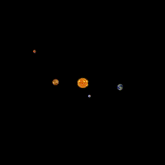

# Planetary Motion Simulation

This is a Python simulation of planetary motion in the Solar System. The simulation uses the pygame library to create an interactive visualization where the user can observe the motion of the planets and interact with them.

## Features

- Realistic representation of the Solar System
- Planets orbiting around the Sun based on their masses and distances
- Accurate scaling of planet sizes and distances

## Requirements

- Python 3.x
- pygame library

## Demo



## Installation

1. Clone the repository:

   ```bash
   git clone https://github.com/your-username/planetary-motion-simulation.git

2. Install the dependencies:
    ```bash
    pip install pygame

## Usage

1. Run the simulation:

    ```bash
    python main.py

2. Customization:

    You can modify the planetary parameters (mass, radius, distance, speed) in the main.py file to create custom simulations.To use different planet images, replace the existing image files in the project directory and update the image paths in the Planet class.

